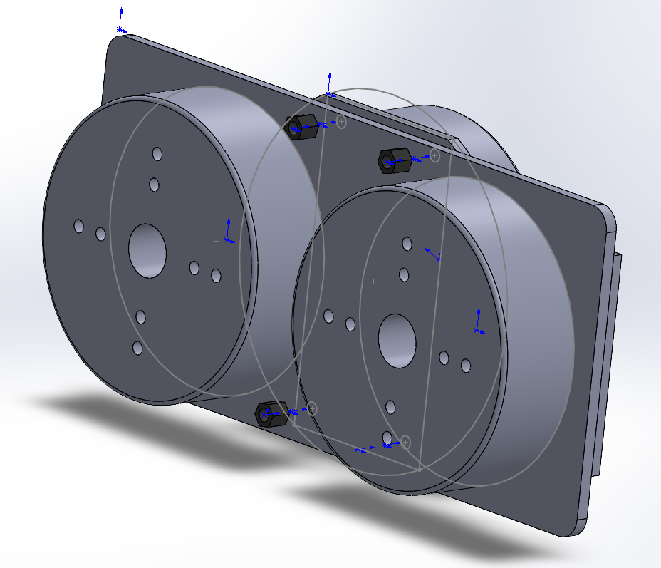

# 基于HT-6010电机的地盘机械结构设计

## HT-6010 参数

| 参数/型号     | 单位  | HT6010         |
| ------------- | ----- | -------------- |
| 匝            |       | 90             |
| 线径*股       |       | 0.3            |
| 额定电压      | V     | 24             |
| 额定电流      | A     | 0.75           |
| 额定力矩      | N.M   | 0.8            |
| 额定转速      | rpm   | 300            |
| 最大空载转速  | rpm   | 800            |
| 堵转扭矩      | N.M   | 0.9            |
| Stall current | A     | 1.8            |
| 接线方式      |       | Y              |
| 线电阻        | Ω     | 7.1            |
| 相间电感      | mH    | 12.62          |
| 转速常数      | rpm/v | 12             |
| 扭矩常数      | N.M/A | 0.6            |
| 转子惯量      | gcm2  | 748            |
| 极对数        |       | 14             |
| 电机重量      | g     | 247            |
| 电机推荐负载  | Kg    | 4              |
| 工作温度范围  | ℃     | -20/80         |
| 编码器类型    |       | AS5048A/AS5600 |
| 编码器精度    | Bit   | 14/12          |
| 滑环尺寸      | mm    | 12.5/22        |

##  左侧支撑

